# Operationalizing a Machine Learning Pipeline on Azure ML

In brief, this project is all about how do we harness the power of Azure ML, a Microsoft SaaS offering. This Azure ML is completely built software into Azure cloud and we can all its services or APIs directly to get our work done. This is called serverless!
Specically, in this project, we have to upload the bankmarketing dataset that we want to analyse on Azure ML. Then we use classification autoML to train the data. It gives us the classification as 'yes' or'no'.
After we run autoML, we select the best performing model and deploy it. After deploying we enable the endpoints and call the model APIs using swagger.json that is generated.
We then create and publish the pipeline and consume its endpoints to interact with the model.

## Architectural Diagram
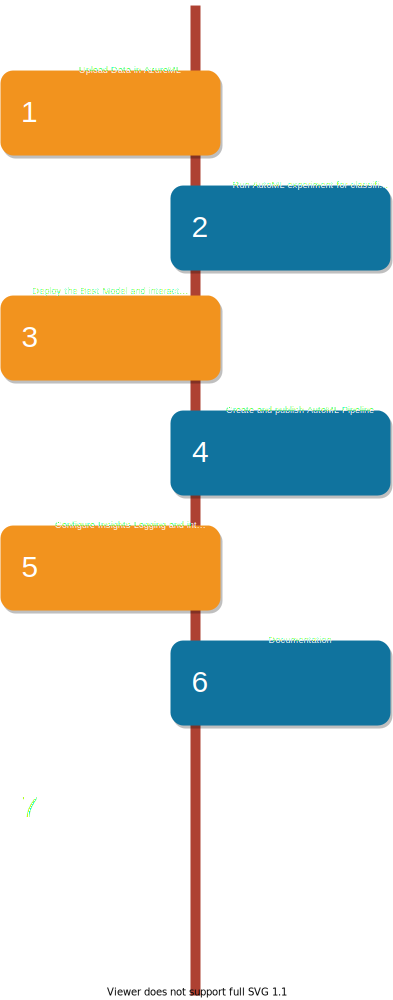

## Key Steps
1. Install azure CLI from Powershell by command: 

Invoke-WebRequest -Uri https://aka.ms/installazurecliwindows -OutFile .\AzureCLI.msi; Start-Process msiexec.exe -Wait -ArgumentList '/I AzureCLI.msi /quiet'; rm .\AzureCLI.msi 

2. Run the az login command to login and then install ML extension
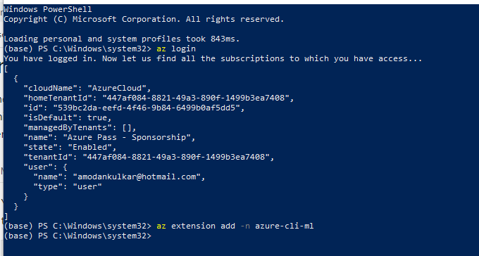

3. Install Azure ML extension for VS Code and open Udacity project (starter files) which is cloned to my own github account. 
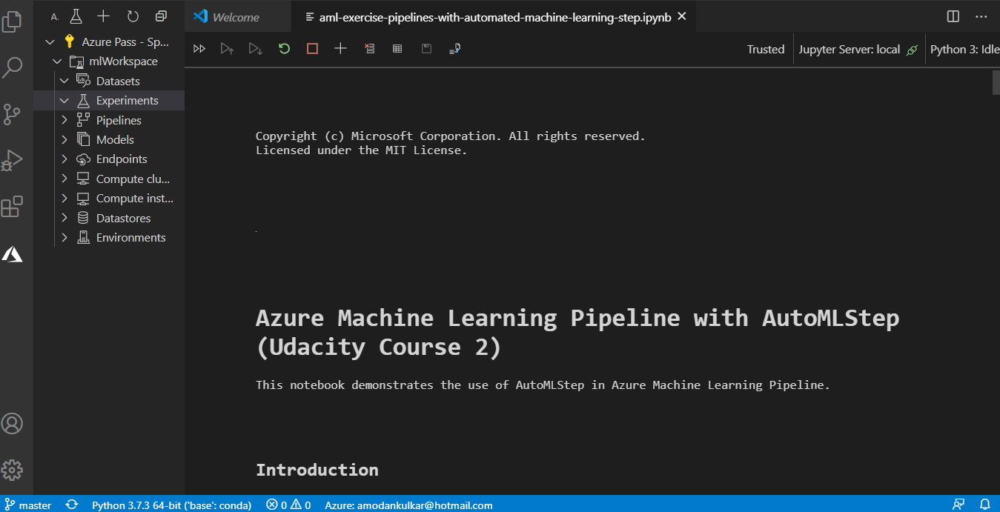

4. Create a Service Principal named sp-ml 
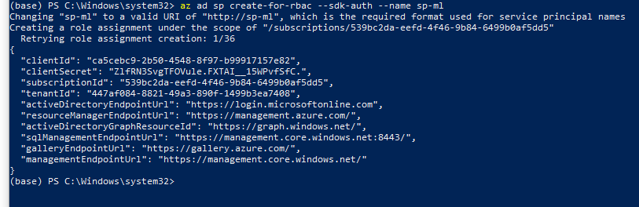

5. Show that the objectID and objectType is Service Principal. 
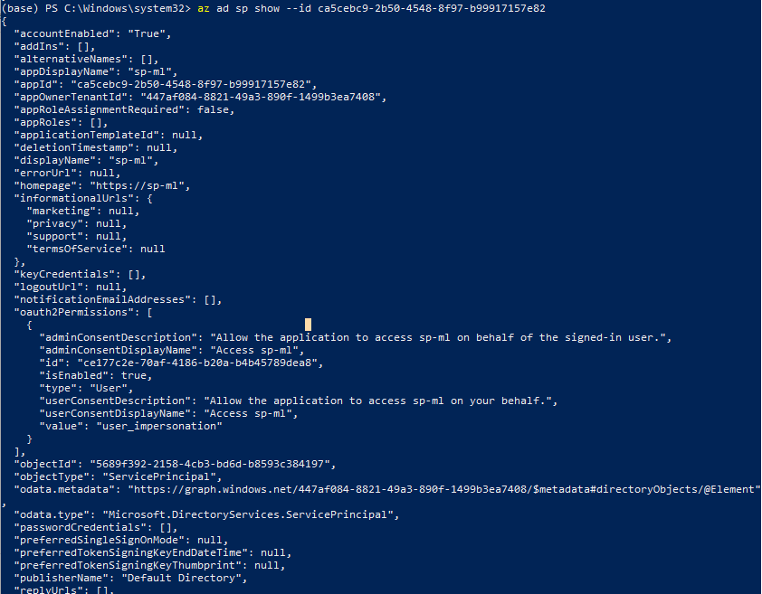

6. Share the workspace with sp
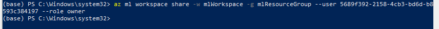

7. Upload and register the bankmarketing dataset
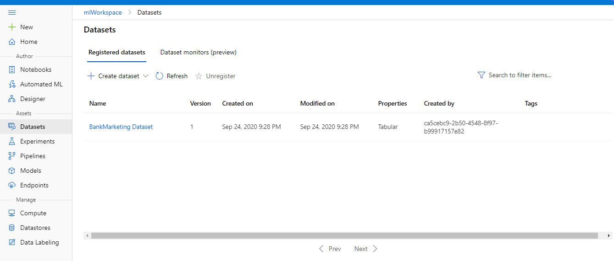

8. Run the autoML experiment and see that is is finished
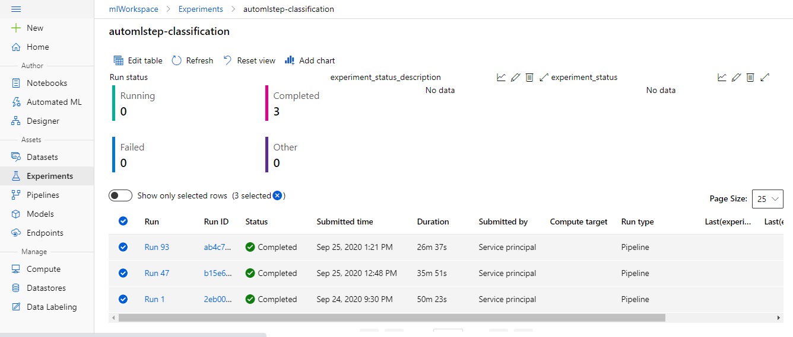

9. See the details of the best model
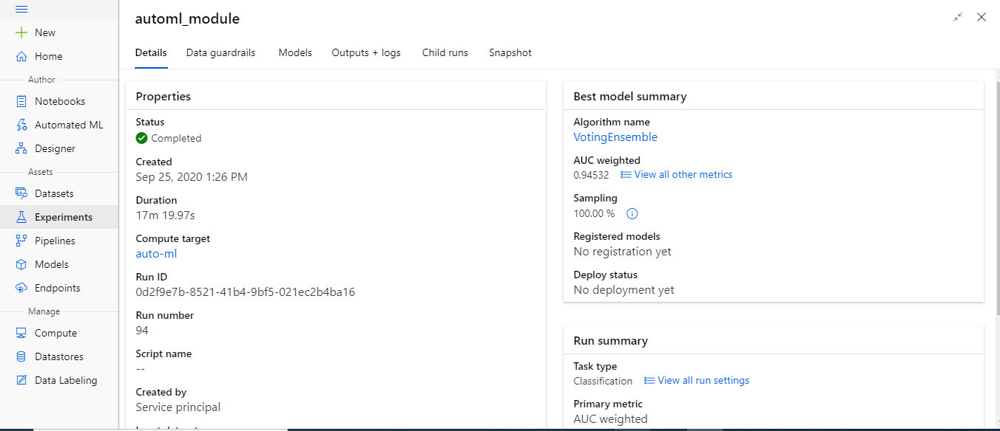

10. Deploy the best model. Ensure that compute type is Azure Container Instance and seethat the authentication is enabled.
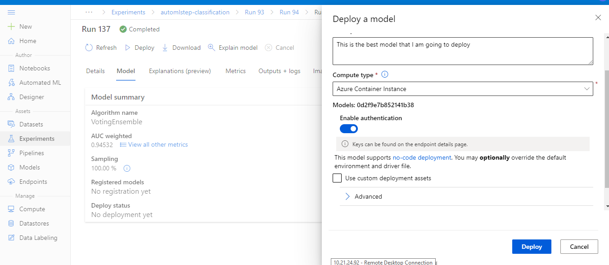

11. See that the model is deployed successfully.
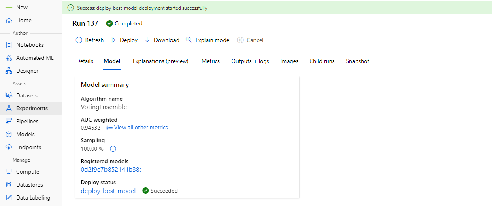

12. Also see the endpoints of the deployed model
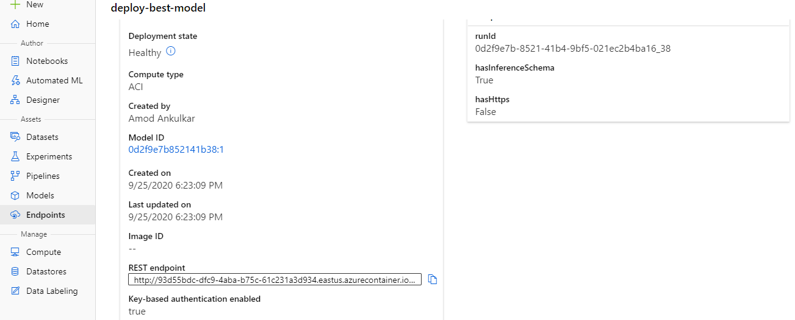

13. Get the key that we have to use to interact with the webservice instance
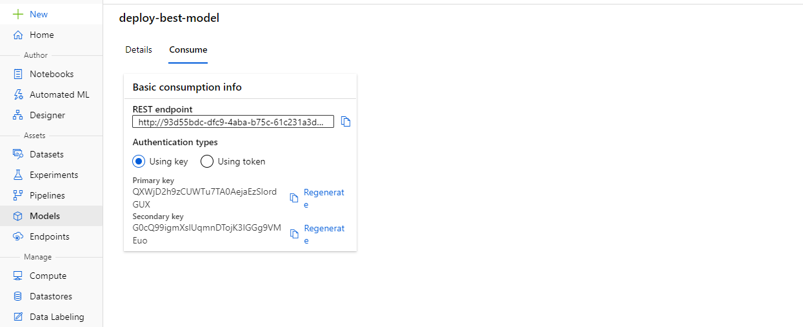

14. Configure the webservice for application insights logging.
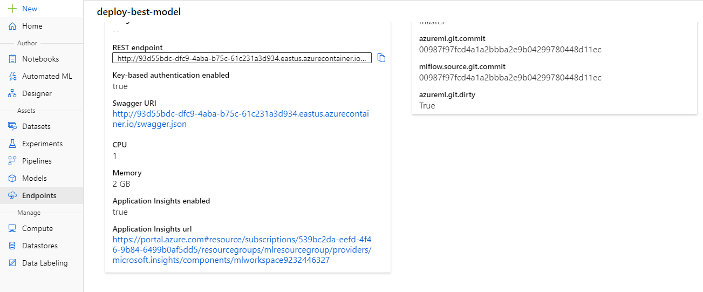

15. See that we can see the logging agter running logs.py program
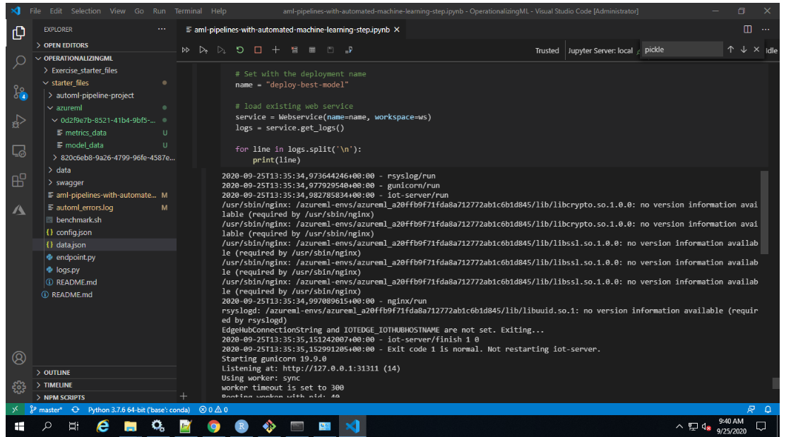

16. Also if we run endpoints.py program then we can see how our model scores a new data.
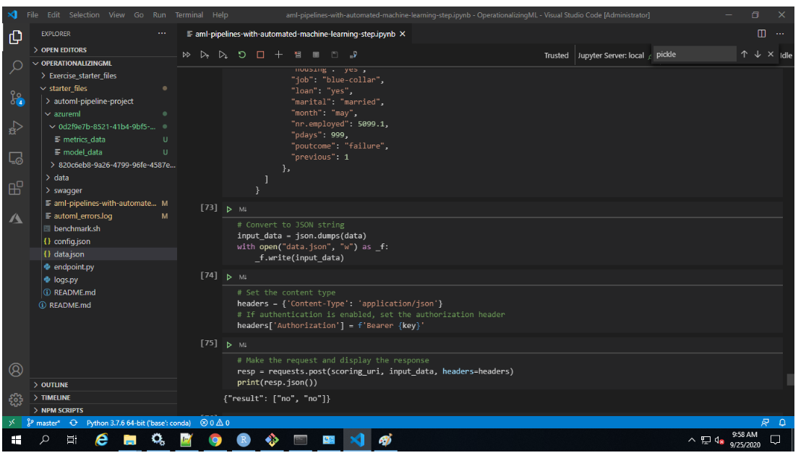

17. See that the swagger service is started on localhost at port 80.
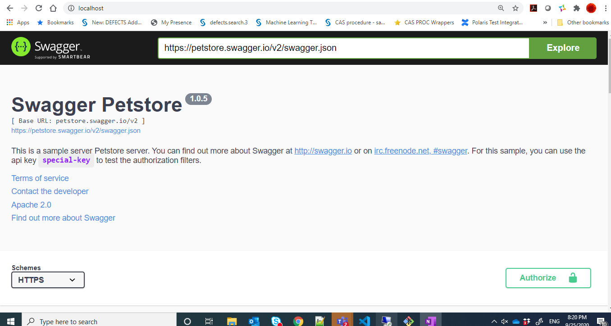

18. Create a pipeline to see if it is created successfully.
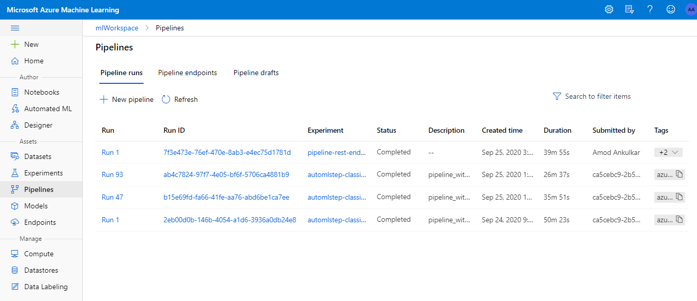

19. In Pipeline section, see for pipeline endpoint as well as Bankmarketing dataset with AutoMLModule.
Also see for published pipeline overview with status as "Active" 
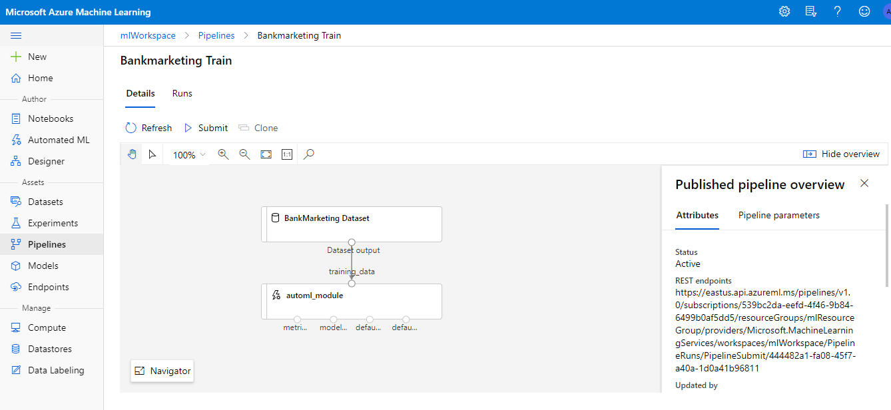

20. We can also see its scheduled run.
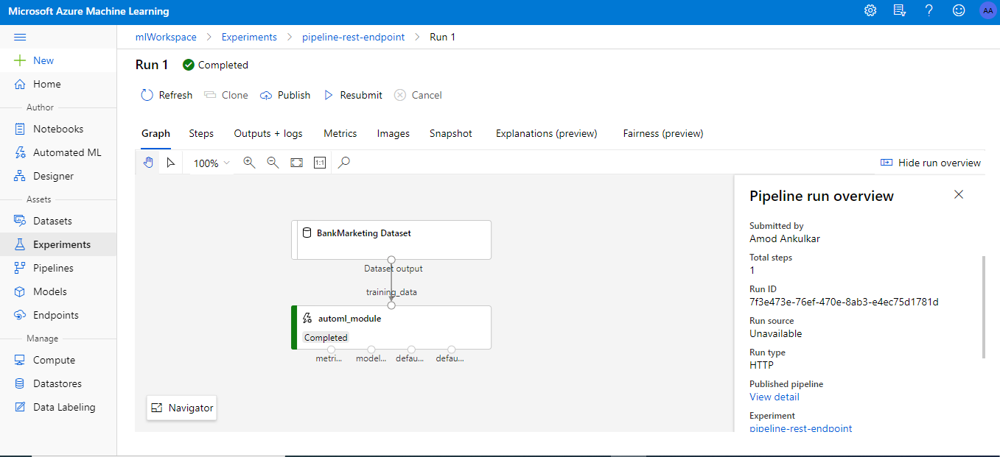

## Screen Recording

